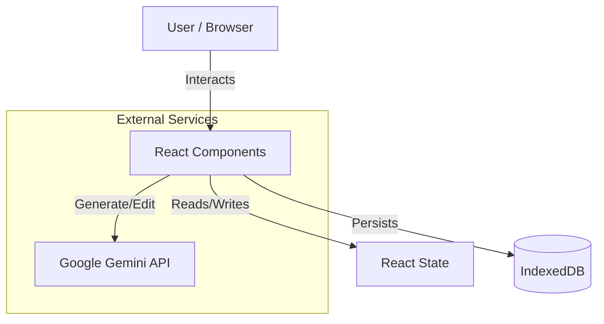

# Architecture Overview

## 1. Executive Summary

InfoGenius Vision currently operates as a **Client-Side, Local-First Single Page Application (SPA)**. 

Unlike traditional web apps that rely heavily on a backend server for every interaction, InfoGenius pushes logic and persistence to the browser edge. This ensures immediate responsiveness, offline capability, and enhanced privacy for rapid prototyping.

*   **Current State:** React SPA + IndexedDB + Direct AI SDK.
*   **Future State:** Next.js BFF + PostgreSQL + S3 (See [ROADMAP.md](./ROADMAP.md)).

---

## 2. Current Architecture (Phase 1)

### A. The UI Layer (React + Tailwind)
- **Component Architecture:** We use a "Controller-View" pattern.
    - **Controllers (e.g., `Editor.tsx`):** Handle business logic, API calls, and state lifting.
    - **Views (e.g., `DashboardCanvas.tsx`):** Pure presentational components that receive data via props and emit events.
- **Lazy Loading:** Major routes (`Dashboard`, `Editor`, `Settings`) are lazy-loaded via `React.Suspense` to minimize initial bundle size.
- **Error Boundaries:** A top-level Error Boundary catches render failures to prevent white-screen crashes.

### B. The Persistence Layer (IndexedDB)
We use a custom wrapper (`lib/db.ts`) around the browser's native IndexedDB.
- **Why IndexedDB?** LocalStorage is synchronous and limited to 5MB. IndexedDB is asynchronous and handles large blobs (Base64 images) efficiently.
- **Data Stores:**
    - `projects`: Stores dashboard metadata, canvas state, and thumbnails.
    - `config`: Stores User Profile, Workspace Settings, and Brand Kit.
    - `audit`: Immutable log of user actions.

### C. The Intelligence Layer (Gemini SDK)
- **Direct Integration:** The client communicates directly with Google's GenAI API.
- **Service Layer (`lib/gemini.ts`):** 
    - Abstracts the API complexity.
    - Handles prompt engineering (injecting Brand Kit rules and Persona constraints).
    - Manages fallback logic (trying SVG generation first, falling back to Raster).

---

## 3. Data Flow

### Image Generation Pipeline
1.  **Input:** User provides a text prompt + optional Data Sources.
2.  **Context Construction:** The app retrieves the active `BrandKit` and `DataSchemas`.
3.  **Prompt Engineering:** A composite prompt is created: `System Instructions` + `Brand Rules` + `User Prompt`.
4.  **API Call:** Sent to `gemini-3-pro-image-preview`.
5.  **Normalization:** Response is converted to a standardized Base64 data URI.
6.  **Persistence:** The Base64 string is saved to IndexedDB inside the `Project` object.
7.  **Rendering:** The string is passed to `DashboardCanvas` for display.

### Canvas State Sync
1.  **Action:** User drags an annotation.
2.  **Local State:** React state updates immediately (optimistic UI).
3.  **Debounce:** A timer waits 500ms-800ms.
4.  **Commit:** The new coordinates are written to IndexedDB.

---

## 4. Security Considerations (Current)

Since the app currently runs client-side:
- **API Keys:** Provided via environment variables (`process.env.API_KEY`) or user input. *Note: In a production deployment, this must be moved to a proxy server.*
- **Data Privacy:** User data lives in their specific browser instance. Clearing browser data wipes the workspace.
- **RBAC:** Roles (Admin/Viewer) are simulated in the UI but enforced by logic, not a secure backend.

---

## 5. Future Architecture (Phase 2 & 3)

To scale to Enterprise, we will migrate to a **Backend-for-Frontend (BFF)** pattern.

- **Next.js Server Actions:** Will replace direct SDK calls to hide API keys.
- **PostgreSQL:** Will replace IndexedDB for shared/collaborative data.
- **S3 Storage:** Will store image assets instead of Base64 strings in the DB.
- **Auth.js:** Will provide secure, cookie-based session management.

*Refactoring is currently underway to prepare the frontend components for this shift.*
